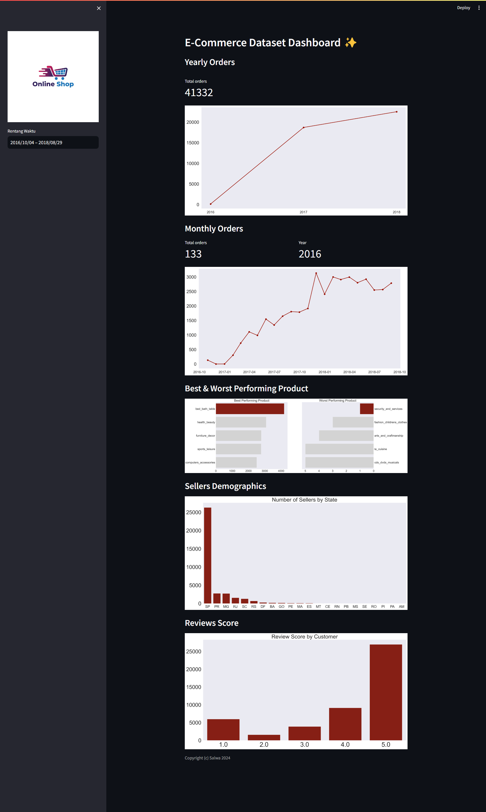

# Submission Proyek Analisis Data E-Commerce dengan Python Dicoding 📊

## Project Data Analisis dengan menggunakan Python

Repositori ini berisi Analisis Data menggunakan Python dengan Data yang telah disediakan oleh Dicoding dan diimplementasikan menggunakan **Streamlit** </img>

## Clone Repository
```
git clone https://github.com/salwaa1212/analisis_data.git
```

## Setup Environment
```
conda create --name main-ds python=3.9
conda activate main-ds
pip install -r requirements.txt
```

## Run Streamlit App
```
streamlit run dashboard.py
```

Kunjungi Website ⬇️⬇️⬇️⬇️⬇️⬇️⬇️⬇️⬇️⬇️⬇️⬇️⬇️

[Project Analisis Data](https://4yrdryatptu6qfbbfarlsz.streamlit.app/)

